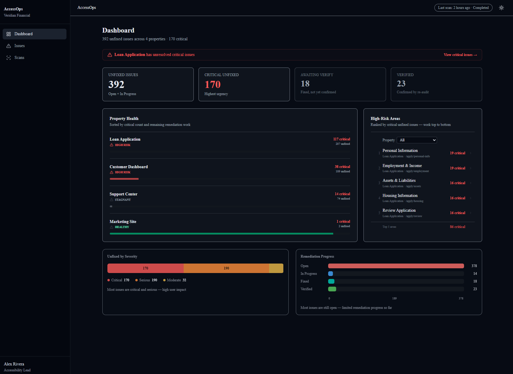
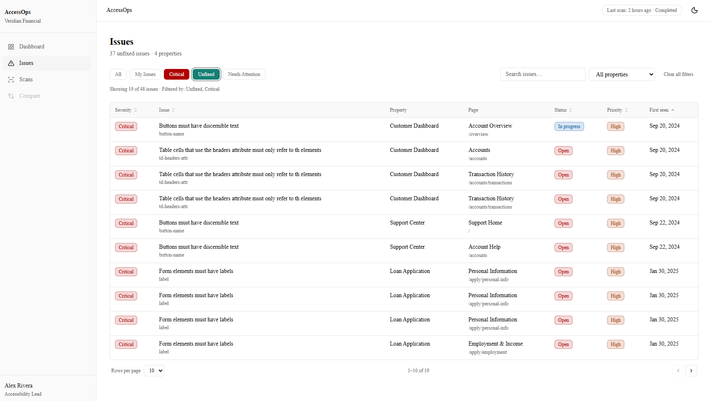
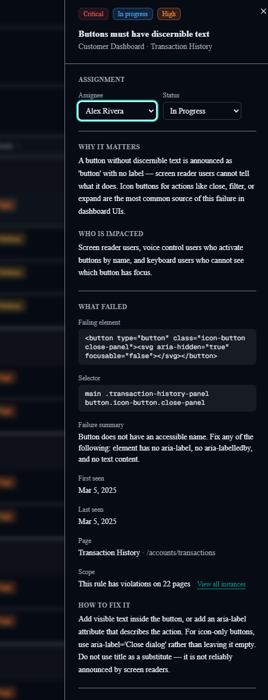
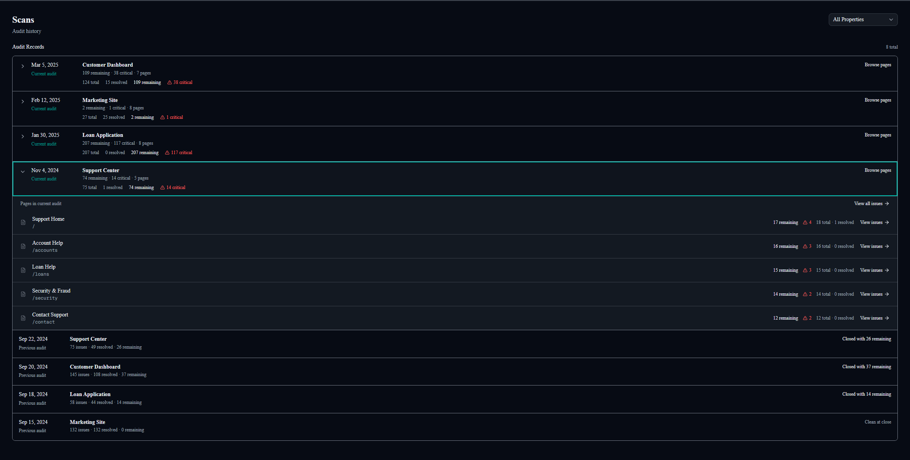
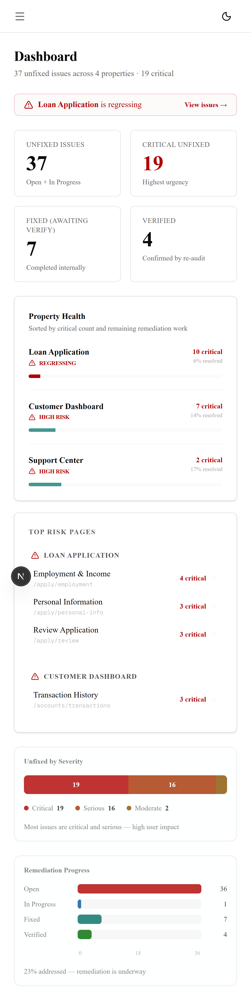

# AccessOps

AccessOps is an accessibility operations platform focused on what happens **after an audit**.

It is built around a simple idea:

> Accessibility doesn’t fail at detection — it fails in remediation.

AccessOps turns an audit into a **working backlog**, helping teams prioritize, fix, and verify accessibility issues in real-world applications.

---

## 🎯 Purpose

Most tools stop at reporting issues.

AccessOps focuses on the actual workflow:

- **What needs to be fixed right now**
- **Where risk is concentrated**
- **How teams work through large accessibility backlogs**

This is not a scanner UI.

It is a **remediation system**.

---

## 🧠 Core Model

AccessOps operates on a **single active audit**.

- An audit establishes a backlog of issues
- Teams work that backlog over time
- Issues move through a lifecycle:
  - Open → In Progress → Fixed → Verified
- A future audit confirms what is actually resolved

Previous audits are closed and treated as **historical summaries**, not active workflows.

---

## 🖥️ Screens

### 📊 Dashboard — Decision Surface

<br>



<br>

The Dashboard answers:

- What still needs to be fixed?
- Where is the highest risk?
- Where should we focus first?

It reflects **current audit state only** — no trends, no history, no noise.

---

### 🔧 Issues — Remediation Workspace (Core Product)

<br>



<br>

The Issues screen is where accessibility work actually happens.

- Handles large datasets (hundreds to 1000+ issues)
- Strong filtering across severity, status, page, and rule
- Highlights repeated issues to expose high-leverage fixes
- Built for real developer workflows

#### Issue Detail Drawer

<br>



<br>

Provides:

- why it matters (plain language)
- who is impacted
- what failed (code-level context)
- how to fix it

This bridges the gap between audit findings and actual implementation.

---

### 🔍 Scans — Audit History

<br>



<br>

Scans provides a lightweight history of audits.

- Current audit is the active backlog
- Previous audits are summary-only
- Used for reference, not day-to-day work

---

### 📱 Mobile

<br>



<br>

Desktop-first design with responsive support for smaller screens.

---

## 🔁 Example Workflow

1. A team receives a new accessibility audit
2. The audit becomes the **active backlog**
3. Dashboard surfaces where risk is concentrated
4. Engineers work through issues in the Issues screen
5. Issues are marked Fixed
6. A future audit verifies what is resolved

---

## 📊 Data Strategy

Seeded data simulates a realistic enterprise accessibility program:

- **Marketing Site** → healthy, well-remediated
- **Loan Application** → highest risk, regression-heavy
- **Customer Dashboard** → active remediation in progress
- **Support Center** → smaller, stagnant backlog

The goal is to demonstrate:

- prioritization
- remediation workflows
- repeated issue patterns
- real-world scale

---

## ⚙️ Tech Stack

- Next.js (App Router)
- React + TypeScript
- Tailwind CSS
- shadcn/ui + Radix
- TanStack Table
- Recharts
- React Hook Form + Zod

---

## ♿ Accessibility

Accessibility is built into the product itself:

- semantic HTML first
- keyboard-first interactions
- proper focus management
- no color-only meaning
- screen reader clarity across states

---

## 🚀 Getting Started

```bash
npm install
npm run dev
npm run build
```
