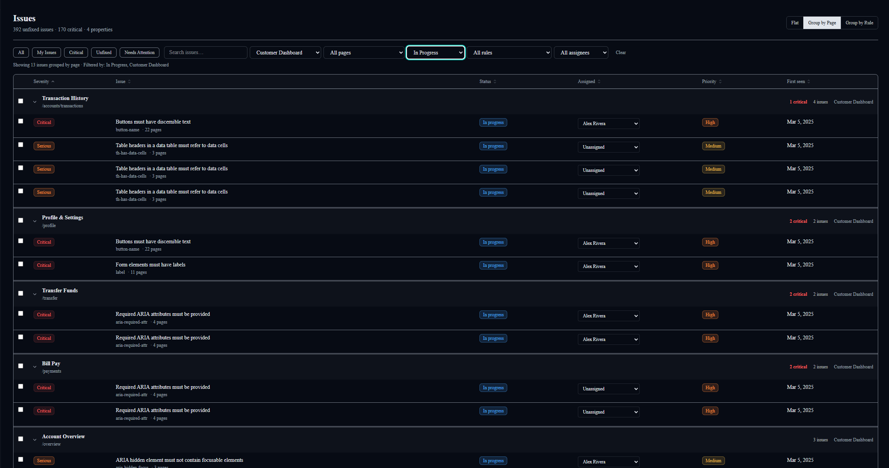
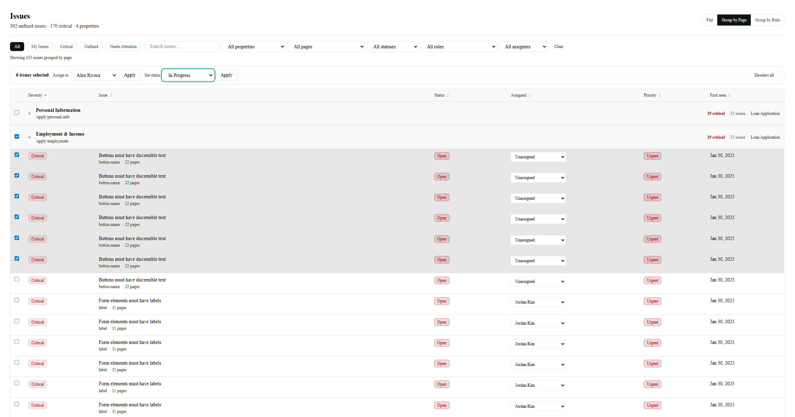

# AccessOps

AccessOps is an accessibility operations platform built around a gap I kept seeing in real accessibility work:

**finding issues is not the hard part — managing remediation is.**

Most accessibility tools are good at detection.
Far fewer are built to help teams turn an audit into focused, trackable engineering work.

AccessOps turns an accessibility audit into a **working remediation backlog** so teams can prioritize risk, assign work, fix issues, and verify what is actually resolved.

## Live Demo

[Explore AccessOps](https://accessops.vercel.app/dashboard)

---

## 🎯 Why I Built It

A lot of accessibility tooling stops at reporting.

You get a scan, a list of violations, maybe a score, maybe an export.

But in practice, that is where the real work starts.

Teams still need to answer questions like:

- What should we fix first?
- Where is risk concentrated right now?
- Which issues are repeated across pages?
- What is actively being worked?
- What is fixed but still waiting on verification?

This is **not** a scanner UI.
This is a **remediation system**.

---

## 🧠 Product Model

AccessOps uses a **single active audit** model.

That means:

- one audit defines the current backlog
- all remediation work happens against that audit
- issues move through a lifecycle as teams work them
- future audits confirm what was actually resolved

### Issue lifecycle

- Open
- In Progress
- Fixed
- Verified
- Accepted Risk

> **What needs to be fixed right now?**

That is the core product question.

---

## 🖥️ Product Surfaces

### 📊 Dashboard — Decision Surface

<br>


<br>

The Dashboard is focused on current audit state only.

It helps teams understand:

- what still needs to be fixed
- where risk is concentrated
- which property needs attention first

---

### 🔧 Issues — Remediation Workspace

<br>


<br>

The Issues screen is the core product.

Instead of treating accessibility findings like raw scan output, AccessOps treats them like **work items in an engineering backlog**.

Key behaviors include:

- filtering across severity, status, property, page, rule, and assignee
- flat and grouped workflows depending on remediation strategy
- repeated issue visibility to expose high-leverage fixes
- assignment and status management directly in the workflow

#### Grouped by Page

<br>



<br>

Grouping helps teams work more strategically by surfacing issue concentration at the page level while preserving actionable rows underneath.

#### Bulk Actions

<br>



<br>

Bulk actions reduce workflow friction when assigning or updating multiple issues at once.

#### Issue Detail Drawer

<br>


<br>

The detail drawer turns an issue from “audit output” into something actionable.

It gives engineers the context they need:

- why the issue matters
- who is impacted
- what failed
- where it appears
- how to fix it
- how to update status and ownership

---

### 🔍 Scans — Audit History

<br>


<br>

Scans is intentionally lightweight.

- the current audit is the entry point into active remediation
- previous audits are summary-only
- historical scans support traceability without competing with the Issues workflow

---

### 📱 Mobile

<br>


<br>

AccessOps is desktop-first because remediation work is data-heavy, but it remains usable on smaller screens.

---

## 🔁 Example Workflow

1. A team receives a new accessibility audit
2. That audit becomes the **active backlog**
3. Dashboard highlights where risk is concentrated
4. Engineers work issues through the Issues screen
5. Issues move from Open / In Progress to Fixed
6. A future audit verifies what is actually resolved

**audit → triage → remediation → verification**

---

## 📊 Seeded Data Strategy

The demo data is intentionally structured to simulate a realistic enterprise accessibility program.

Each property tells a different story:

- **Marketing Site** → healthier state, strong remediation progress
- **Loan Application** → highest risk, regression-heavy, largest backlog
- **Customer Dashboard** → active remediation with mixed progress
- **Support Center** → smaller stagnant backlog

---

## ⚙️ Tech Stack

- Next.js (App Router)
- React + TypeScript
- Tailwind CSS
- shadcn/ui + Radix
- TanStack Table
- Recharts
- React Hook Form + Zod

---

## ♿ Accessibility

Because the product is about accessibility operations, the product itself reflects accessibility discipline in the implementation.

That includes:

- semantic HTML first
- keyboard-first interaction patterns
- visible focus states
- proper focus management
- screen reader clarity across tables, filters, and drawers
- no color-only meaning

---

## 🚀 Getting Started

```bash
npm install
npm run dev
npm run build
```
